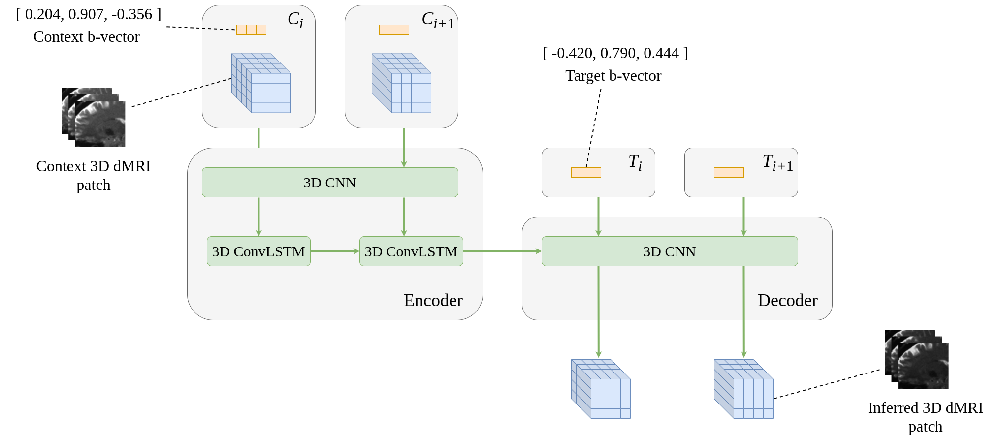

# Angular Super-Resolution in Diffusion MRI with a 3D Recurrent Convolutional Autoencoder



[](https://badge.fury.io/py/dmri-rcnn)

This project enhances the angular resolution of dMRI data through the use of a Recurrent CNN.

## Table of contents
* [Installation](#installation)
* [Inference](#inference)
* [Training](#training)
* [Docker](#docker)
* [Spherical Harmonic Baseline](#spherical-harmonic-baseline)

## Installation
`dMRI-RCNN` can be installed by via pip:
```bash
pip install dmri-rcnn
```

### Requirements
`dMRI-RCNN` uses [TensorFlow](https://www.tensorflow.org/) as the deep learning architecture. To enable [GPU usage within TensorFlow](https://www.tensorflow.org/install/gpu), you should ensure the appropriate prerequisites are installed.

Listed below are the requirements for this package.
- `tensorflow>=2.6.0`
- `numpy`
- `einops`
- `nibabel`
- `tqdm`

## Inference
Once installed, use `run_dmri_rcnn.py` to perform inference of new dMRI volumes. Below lists the data requirements to use the script, and the commandline arguments available for inference.

### Data
To run this script, dMRI data is required in the following format:
- Context dMRI file. The dMRI data used as context within the model to infer other volumes
  - File format: `NIfTI`
  - Single-shell: containing only one b-value.
  - Dimensions: `(i, j, k, q_in)`.
    - `(i, j, k)` are the spatial dimensions of the data
    - `q_in` number of samples within the q-space dimension. This can either be `6`, `10`, or `30` and will affect which of the trained models is used.
- Context b-vector file. The corresponding b-vectors for the context dMRI file.
  - File format: text file, whitespace delimited.
  - `3` rows corresponding to the `x, y, z` co-ordinates of q-space
  - `q_in` columns corresponding to the q-space directions sampled. `q_in` must either be `6`, `10`, or `30`.
- Target b-vector file. The corresponding b-vectors for the inferred dMRI data.
  - File format: text file, whitespace delimited.
  - `3` rows corresponding to the `x, y, z` co-ordinates of q-space
  - `q_out` columns corresponding to the q-space directions sampled.
- Brain mask file. Binary brain mask file for dMRI data.
  - File format: `NIfTI`
  - Dimensions: `(i, j, k)`. Same spatial dimensions as used in the dMRI data.

The script will create the following data:
- Inferred dMRI file. dMRI volumes inferred from the model as defined by the target b-vectors.
  - File format: `NIfTI`
  - Dimensions: `(i, j, k, q_out)`.
    - `q_out` number of samples within the q-space dimension. This can any number, though using higher numbers will require more GPU memory if using.

### Commandline
Bring up the following help message via `run_dmri_rcnn.py -h`:
```
usage: `run_dmri_rcnn.py` [-h] -dmri_in DMRI_IN -bvec_in BVEC_IN -bvec_out BVEC_OUT -mask MASK -dmri_out DMRI_OUT -s {1000,2000,3000} [-m {1,3}] [-c] [-b BATCH_SIZE]

optional arguments:
  -h, --help            show this help message and exit
  -dmri_in DMRI_IN      Context dMRI NIfTI volume. Must be single-shell and contain q_in 3D volumes
  -bvec_in BVEC_IN      Context b-vector text file. Whitespace delimited with 3 rows and q_in columns
  -bvec_out BVEC_OUT    Target b-vector text file. Whitespace delimited with 3 rows and q_out columns
  -mask MASK            Brain mask NIfTI volume. Must have space spatial dimensions as dmri_in.
  -dmri_out DMRI_OUT    Inferred dMRI NIfTI volume. This will contain q_out inferred volumes.
  -s {1000,2000,3000}, --shell {1000,2000,3000}
                        Shell to perform inference with. Must be same shell as context/target dMRI and b-vectors
  -m {1,3}, --model-dim {1,3}
                        Model dimensionality, choose either 1 or 3. Default: 3.
  -c, --combined        Use combined shell model. Currently only applicable with 3D model and 10 q_in.
  -n, --norm            Perform normalisation using 99 percentile of data. Only implemented with --combined flag, and only for q_in = 10
  -b BATCH_SIZE, --batch-size BATCH_SIZE
                        Batch size to run model inference with.
```

***N.B.** Weights are downloaded and stored within `~/.dmri_rcnn` by default. To store weights in a different directory, set environment variable `DMRI_RCNN_DIR="/your/custom/directory"`*


#### Example
The following example performs `b = 1000` inference with the 3D dMRI RCNN on **HCP data**.
```
$ run_dmri_rcnn.py -dmri_in context_dmri.nii.gz -bvec_in context_bvecs -bvec_out target_bvecs -mask brain_mask.nii.gz -dmri_out inferred_dmri.nii.gz -s 1000 -m 3
```
This example would take ~2 minutes to infer 80 volumes on an `NVIDIA RTX 3080`.

To perform inference on data outside of the HCP dataset, use the flags `-c` and `-n`. This is currently only implemented for $q_{in} = 10$.

## Training
Below are details on how to train a given model, and the preprocessing steps involved.

### Data Pre-Processing
A training dataset is typically too large to fit into memory all at once. To overcome this, this project uses TensorFlow's `.tfrecord` file format and the
[tf.data.Dataset](https://www.tensorflow.org/api_docs/python/tf/data/Dataset) API. Therefore training data should be saved in this format before starting. Below is an example on how to do this using the `dMRI-RCNN` project.

```python
import numpy as np

from dmri_rcnn.core import io
from dmri_rcnn.core.processing import save_tfrecord_data

# First load a subject into memory
dmri, _ = io.load_nifti('/path/to/dmri/data.nii.gz')
mask, _ = io.load_nifti('/path/to/brain/mask.nii.gz', dtype=np.int8)
bvecs = io.load_bvec('/path/to/dmri/bvecs') # bvecs & bvals should be in FSL format
bvals = io.load_bval('/path/to/dmri/bvals')

# Optionally crop image data
dmri, mask = io.autocrop_dmri(dmri, mask)

# .tfrecord format uses a maximum filesize of 2 GiB, therefore for high
# resolution dMRI data, the image may need to be split into smaller parts
# to do this use the function below. It is recommended to first try to save
# each subject as a whole before splitting the image into separate files.
dmri_list = io.split_image_to_octants(dmri)
mask_list = io.split_image_to_octants(mask)

# Now save data in .tfrecord format
save_tfrecord_data(dmri, bvecs, bvals, mask, '/path/to/saved/data.tfrecord')

# Alternatively save the list of image parts if dmri is too large
for i in range(len(dmri_list)):
  save_tfrecord_data(dmri_list[i], bvecs, bvals, mask_list[i], '/path/to/saved/data' + str(i) + '.tfrecord')
```

### Training a Model
Once pre-processing is complete, you can then train a model.

```python
from dmri_rcnn.core.weights import get_weights
from dmri_rcnn.core.model import get_1d_autoencoder, get_3d_autoencoder
from dmri_rcnn.core.processing import TrainingProcessor, TrainingProcessorNorm

# If we want to fine-tune the model we can load the previously obtained weights.
# In this example we'll load the weights for the 3D RCNN trained on the b = 1000
# shell and 6 q-space samples per input.
weights = get_weights(model_dim=3, shell=1000, q_in=6)

# Now we can instantiate the pre-compiled 3D model
model = get_3d_autoencoder(weights) # Omit the weights argument to load without pre-trained weights

# Instantiate the training processor
processor = TrainingProcessor(shells=[1000], q_in=6)

# If using non-HCP data, the TrainingProcessorNorm should be used instead.
processor = TrainingProcessorNorm(shells=[1000], q_in=6)

# Important: Here our q_in = 6, and the processor uses a default q_out = 10, therefore our dmri data must
# contain at least 16 volumes.

# Load dataset mapping
train_data = processor.load_data(['/path/to/train_data0.tfrecord', '/path/to/train_data1.tfrecord'])
validation_data = processor.load_data(['/path/to/val_data0.tfrecord'], validation=True)

# Begin training
model.fit(train_data, epochs=10, validation_data=validation_data)
```

## Docker
You can also use `dMRI-RCNN` directly via [Docker](https://www.docker.com/). Both a CPU and GPU version of the project are available.

### CPU
To use `dMRI-RCNN` with the CPU only, use:
```bash
sudo docker run -v /absolute/path/to/my/data/directory:/data -it -t mlyon93/dmri-rcnn-cpu:latest
```

### GPU
To use `dMRI-RCNN` with the GPU, first ensure the [appropriate NVIDIA prerequisites](https://docs.nvidia.com/datacenter/cloud-native/container-toolkit/install-guide.html#docker) have been installed. Then use:
```bash
sudo docker run --gpus all -v /absolute/path/to/my/data/directory:/data -it -t mlyon93/dmri-rcnn-gpu:latest
```

## Spherical Harmonic Baseline
To run the Spherical Harmonic baseline model used in the paper, first ensure `dipy` is installed. You can install `dipy` directly via `pip` or by installing this project using the following prompt.

```
pip install dmri-rcnn[sh]
```

### Commandline
Bring up the following help message via `dmri_sh_baseline.py -h`:

```
usage: dMRI Spherical Harmonic Baseline Inference [-h] -dmri_in DMRI_IN -bvec_in BVEC_IN -bvec_out BVEC_OUT -dmri_out DMRI_OUT -s SHELL

optional arguments:
  -h, --help            show this help message and exit
  -dmri_in DMRI_IN      Context dMRI NIfTI volume. Must be single-shell and contain q_in 3D volumes
  -bvec_in BVEC_IN      Context b-vectory text file. Whitespace delimited with 3 rows and q_in columns
  -bvec_out BVEC_OUT    Target b-vector text file. Whitespace delimited with 3 rows and q_out columns
  -dmri_out DMRI_OUT    Inferred dMRI NIfTI volume. This will contain q_out inferred volumes.
  -s SHELL, --shell SHELL
                        Shell to perform inference on. Must be same shell as context/target dMRI and b-vecs
```

#### Example

The following example performs `b = 1000` spherical harmonic inference.
```
$ dmri_sh_baseline.py -dmri_in context_dmri.nii.gz -bvec_in context_bvecs -bvec_out target_bvecs -dmri_out inferred_dmri.nii.gz -s 1000
```

The use or inspect the spherical harmonic model, the code can be found within `dmri_rcnn.core.processing.sph_harmonic`.


## Roadmap
Future Additions & Improvements:
- Plot functionality
